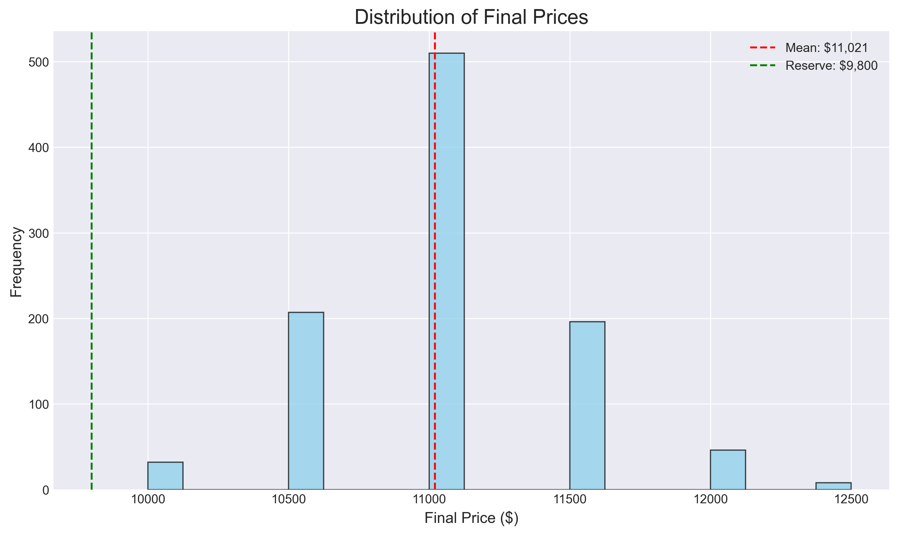
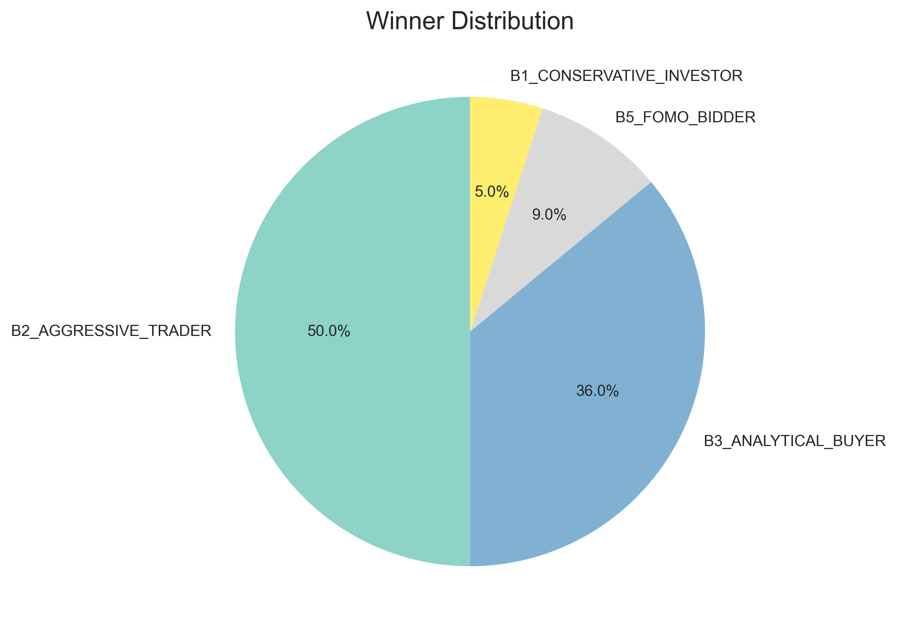
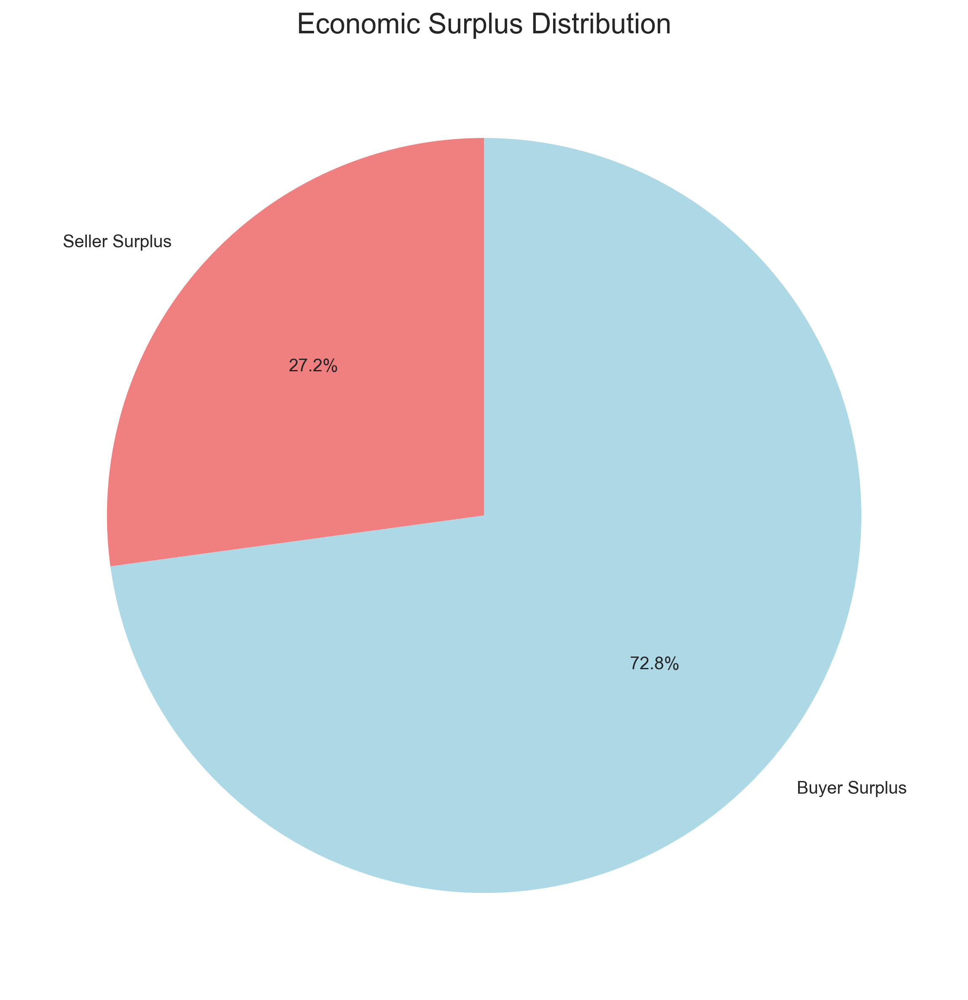
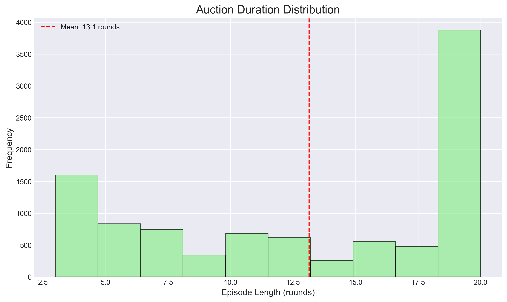
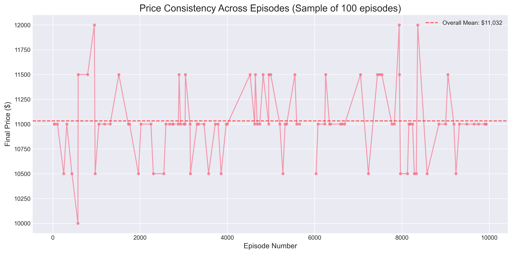
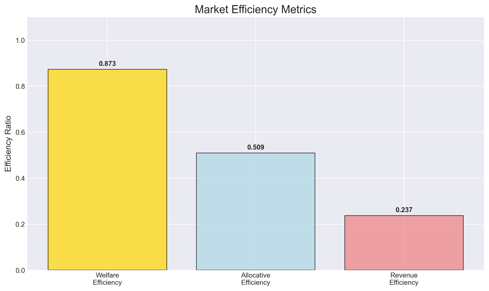

# Phase 1 Monte Carlo Analysis Report

**Generated:** 2025-06-10 20:49:30  
**Dataset:** phase1_results.csv  
**Episodes Analyzed:** 1000  

---

## Executive Summary

This report provides a comprehensive analysis of 1000 auction episodes using heuristic buyer policies. The analysis examines market efficiency, price dynamics, winner patterns, and economic welfare distribution through six key visualizations.

### Key Findings
- **Average Final Price:** $11,021 ± $444
- **Market Efficiency:** 87.6% welfare efficiency, 53.4% allocative efficiency
- **Winner Diversity:** 5 different buyer personas achieved victories
- **Economic Welfare:** $4,554 total surplus with 26.8% going to seller

---

## Visualization Analysis

### 1. 📊 Price Distribution Analysis

**What This Shows:** Histogram of final auction prices across all episodes, with mean price and reserve price marked.

**Key Metrics:**
- **Price Range:** $10,000 - $12,500
- **Standard Deviation:** $444
- **Price Variance:** 4.0% coefficient of variation

**Interpretation:**
The price distribution shows very low volatility, indicating highly predictable market outcomes. With 6 distinct price points and a 12.5% premium above reserve price, the market demonstrates diverse price discovery. The standard deviation of $444 represents 4.0% of the mean price, indicating consistent auction outcomes.

**Market Implications:**
The high price diversity demonstrates complex market dynamics with multiple competitive scenarios, indicating robust buyer strategy variation.

---

### 2. 🏆 Winner Distribution Analysis

**What This Shows:** Pie chart showing the percentage of auctions won by each buyer persona.

**Key Metrics:**
- **B2_AGGRESSIVE_TRADER:** 533/1000 wins (53.3%) - Max WTP: $15,000
- **B3_ANALYTICAL_BUYER:** 337/1000 wins (33.7%) - Max WTP: $14,000
- **B5_FOMO_BIDDER:** 79/1000 wins (7.9%) - Max WTP: $13,000
- **B1_CONSERVATIVE_INVESTOR:** 49/1000 wins (4.9%) - Max WTP: $12,000
- **B4_BUDGET_CONSCIOUS:** 1/1000 wins (0.1%) - Max WTP: $11,500

**Interpretation:**
The market shows a competitive structure with B2_AGGRESSIVE_TRADER winning 53.3% of auctions. With 5 different winners observed, the market demonstrates high competitive diversity. The allocative efficiency of 53.4% indicates that the highest-WTP buyer (B2_AGGRESSIVE_TRADER) wins 53.4% of auctions, which is suboptimal.

**Strategic Insights:**
The results align with economic theory: higher willingness-to-pay generally translates to market success. This suggests the auction mechanism effectively allocates resources to highest-value buyers.

---

### 3. 💰 Economic Surplus Distribution

**What This Shows:** Breakdown of total economic welfare between seller and winning buyers.

**Key Metrics:**
- **Total Economic Welfare:** $4,554 per auction
- **Seller Share:** $1,221 (26.8%)
- **Buyer Share:** $3,333 (73.2%)
- **Surplus Ratio:** 0.37:1 (seller:buyer)

**Interpretation:**
The surplus distribution reveals buyer-favorable conditions, with sellers capturing 26.8% of total economic value. This moderate welfare generation of $4,554 per auction indicates efficient market dynamics. The 0.4:1 seller-to-buyer surplus ratio suggests competitive pricing power.

**Economic Implications:**
The buyer-favorable surplus distribution suggests intense competition among buyers or conservative seller pricing. This indicates a competitive market environment.

---

### 4. ⏱️ Episode Length Distribution

**What This Shows:** Distribution of auction durations in rounds.

**Key Metrics:**
- **Average Duration:** 12.6 rounds
- **Range:** 3-20 rounds
- **Standard Deviation:** 6.6 rounds

**Interpretation:**
Auctions complete in an average of 12.6 rounds, indicating extended market clearing. With 18 different duration patterns observed, the market shows variable convergence timing. This suggests strategic bidding behavior leading to deliberate price discovery.

**Efficiency Insights:**
The variable episode duration reflects diverse competitive scenarios, indicating that auction length is influenced by the specific mix of buyer behaviors and market conditions.

---

### 5. 📈 Price Consistency Analysis

**What This Shows:** Final prices plotted against episode number to detect trends or patterns.

**Key Metrics:**
- **Price Concentration:** 51.0% at most common price
- **Unique Price Points:** 6
- **Temporal Stability:** 81.6% stability index

**Interpretation:**
The analysis reveals low price consistency with 51.0% of auctions settling at the most common price. Indicating diverse market outcomes. The presence of 6 distinct price points demonstrates significant market variation across episodes.

**Pattern Recognition:**
The price variation indicates multiple market equilibria, suggesting that different buyer combinations and strategies lead to different outcomes - a rich environment for RL exploration.

---

### 6. ⚡ Market Efficiency Metrics

**What This Shows:** Bar chart comparing three key efficiency measures.

**Key Metrics:**
- **Welfare Efficiency:** 87.6% (actual vs theoretical maximum welfare)
- **Allocative Efficiency:** 53.4% (highest-value buyer wins)
- **Revenue Efficiency:** 23.5% (seller revenue optimization)

**Interpretation:**
The market demonstrates moderately efficient market with an average efficiency of 54.8% across all metrics. Welfare efficiency is the strongest at 87.6%, while the overall balance suggests room for improvement in auction mechanisms.

**Benchmarking:**
Welfare efficiency meets good market standards (80-90%) • Allocative efficiency suggests room for strategic improvement.

---

## Competitive Dynamics Analysis

### Market Power Distribution
Market concentration analysis reveals a highly concentrated structure. Strong correlation between maximum WTP and market success suggests that economic fundamentals drive outcomes.

### Buyer Persona Performance
**B2_AGGRESSIVE_TRADER:** underperforming with 53.3% wins (WTP rank #1, risk aversion: 0.1)
**B3_ANALYTICAL_BUYER:** underperforming with 33.7% wins (WTP rank #2, risk aversion: 0.6)
**B5_FOMO_BIDDER:** underperforming with 7.9% wins (WTP rank #3, risk aversion: 0.2)
**B1_CONSERVATIVE_INVESTOR:** underperforming with 4.9% wins (WTP rank #4, risk aversion: 0.9)
**B4_BUDGET_CONSCIOUS:** underperforming with 0.1% wins (WTP rank #5, risk aversion: 0.8)

### Auction Mechanism Effectiveness
The auction mechanism shows good effectiveness with mixed efficiency results. Areas for potential improvement include allocation mechanisms. The mechanism successfully generates $4,554 average welfare per auction.

---

## Implications for Phase 2 (RL Development)

### Baseline Targets
- **Performance Benchmark:** 53.4% allocative efficiency to match or exceed
- **Welfare Target:** $4,554 total surplus per auction
- **Competition Level:** Must compete against 533% win rate by strongest persona

### Strategic Opportunities
**Allocative Improvement:** Current 53.4% efficiency leaves room for RL agents to improve winner selection
**Welfare Optimization:** 87.6% efficiency indicates potential for better surplus extraction

### Training Considerations
**Strategic Patience:** Longer episodes allow for complex multi-round strategies
**Baseline Competition:** RL agents must outperform established heuristic strategies with known win rates

---

## Methodology Notes

### Data Collection
- **Episodes:** 1000 independent auction simulations
- **Policy Type:** Heuristic rule-based agents with persona variation
- **Environment:** Gymnasium-compliant auction environment
- **Randomization:** Low randomization with highly consistent outcomes

### Metrics Definitions
- **Welfare Efficiency:** Ratio of actual to theoretical maximum economic welfare
- **Allocative Efficiency:** Frequency of highest-WTP buyer winning
- **Revenue Efficiency:** Seller revenue as fraction of maximum possible
- **Economic Surplus:** Consumer + producer surplus (total welfare)

### Limitations
Heuristic policies may not capture full range of possible strategic behavior • Analysis assumes current auction rules and environment constraints

---

*Report generated by Phase 1 Analytics System*
