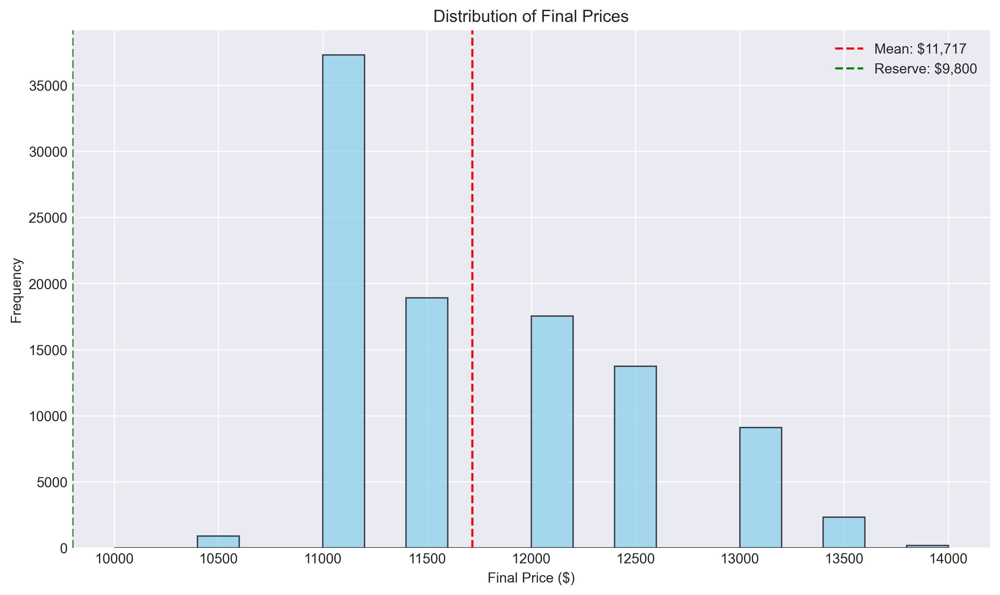
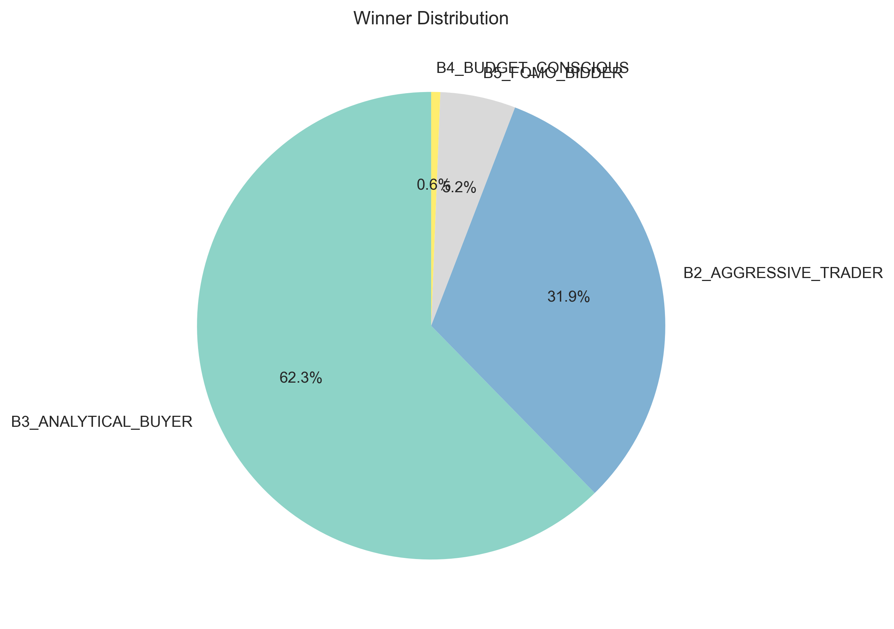
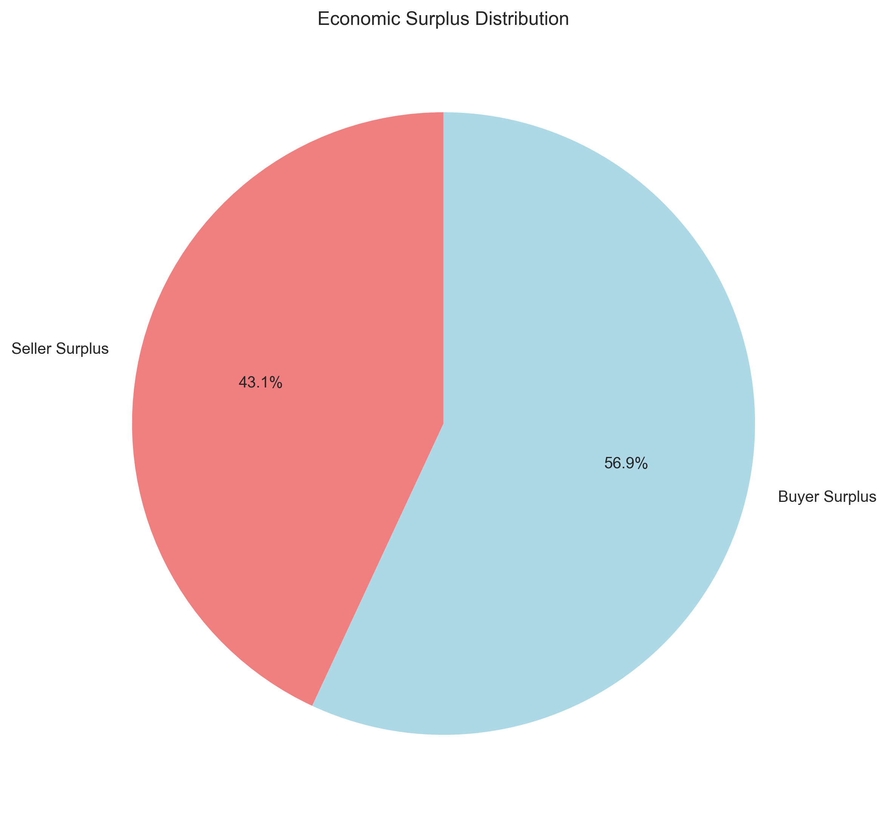
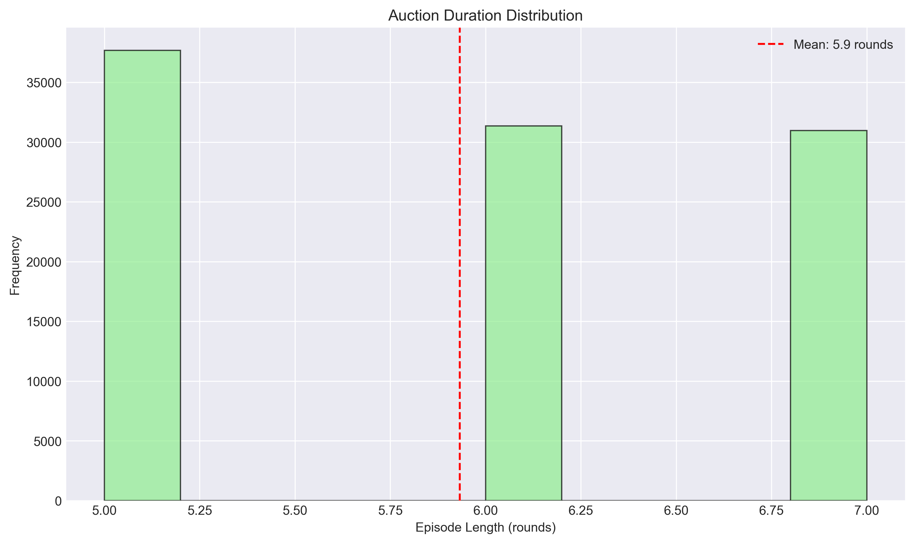
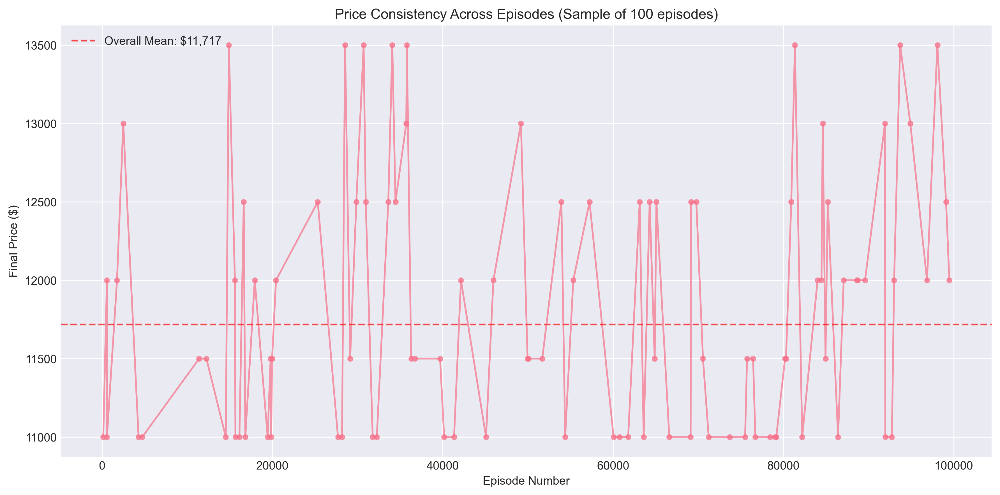
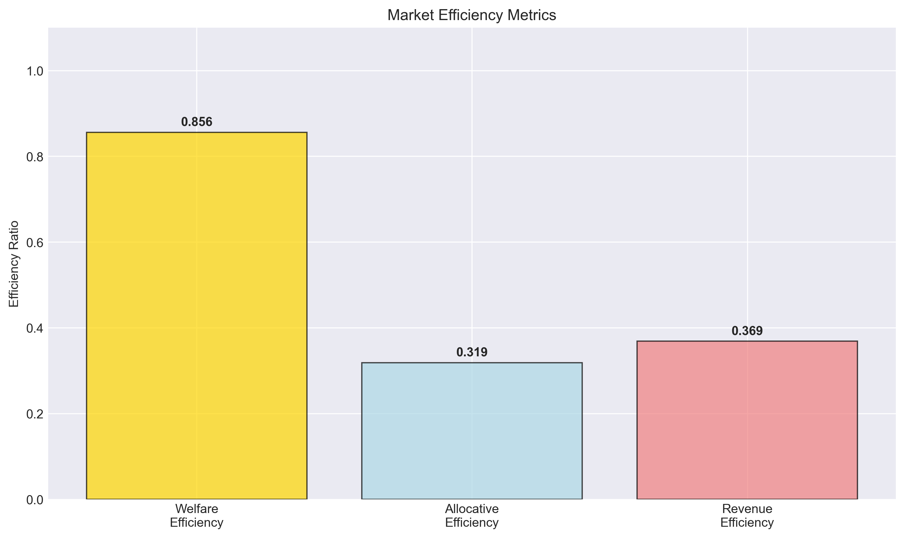

# Phase 1 Monte Carlo Analysis Report

**Generated:** 2025-06-09 19:49:00  
**Dataset:** phase1_final.csv  
**Episodes Analyzed:** 100000  

---

## Executive Summary

This report provides a comprehensive analysis of 100000 auction episodes using heuristic buyer policies. The analysis examines market efficiency, price dynamics, winner patterns, and economic welfare distribution through six key visualizations.

### Key Findings
- **Average Final Price:** $11,717 ± $739
- **Market Efficiency:** 85.6% welfare efficiency, 31.9% allocative efficiency
- **Winner Diversity:** 4 different buyer personas achieved victories
- **Economic Welfare:** $4,451 total surplus with 43.1% going to seller

---

## Visualization Analysis

### 1. 📊 Price Distribution Analysis

**What This Shows:** Histogram of final auction prices across all episodes, with mean price and reserve price marked.

**Key Metrics:**
- **Price Range:** $10,000 - $14,000
- **Standard Deviation:** $739
- **Price Variance:** 6.3% coefficient of variation

**Interpretation:**
The price distribution shows low volatility with consistent pricing patterns. With 9 distinct price points and a 19.6% premium above reserve price, the market demonstrates diverse price discovery. The standard deviation of $739 represents 6.3% of the mean price, indicating consistent auction outcomes.

**Market Implications:**
The high price diversity demonstrates complex market dynamics with multiple competitive scenarios, indicating robust buyer strategy variation.

---

### 2. 🏆 Winner Distribution Analysis

**What This Shows:** Pie chart showing the percentage of auctions won by each buyer persona.

**Key Metrics:**
- **B3_ANALYTICAL_BUYER:** 62312/100000 wins (62.3%) - Max WTP: $14,000
- **B2_AGGRESSIVE_TRADER:** 31858/100000 wins (31.9%) - Max WTP: $15,000
- **B5_FOMO_BIDDER:** 5204/100000 wins (5.2%) - Max WTP: $13,000
- **B4_BUDGET_CONSCIOUS:** 626/100000 wins (0.6%) - Max WTP: $11,500

**Interpretation:**
The market shows a competitive structure with B3_ANALYTICAL_BUYER winning 62.3% of auctions. With 4 different winners observed, the market demonstrates high competitive diversity. The allocative efficiency of 31.9% indicates that the highest-WTP buyer (B2_AGGRESSIVE_TRADER) wins 31.9% of auctions, which is suboptimal.

**Strategic Insights:**
Interestingly, the most frequent winner is not the highest-WTP buyer, indicating that strategic bidding behavior and risk preferences significantly impact outcomes beyond raw purchasing power.

---

### 3. 💰 Economic Surplus Distribution

**What This Shows:** Breakdown of total economic welfare between seller and winning buyers.

**Key Metrics:**
- **Total Economic Welfare:** $4,451 per auction
- **Seller Share:** $1,917 (43.1%)
- **Buyer Share:** $2,534 (56.9%)
- **Surplus Ratio:** 0.76:1 (seller:buyer)

**Interpretation:**
The surplus distribution reveals buyer-favorable conditions, with sellers capturing 43.1% of total economic value. This moderate welfare generation of $4,451 per auction indicates efficient market dynamics. The 0.8:1 seller-to-buyer surplus ratio suggests competitive pricing power.

**Economic Implications:**
The buyer-favorable surplus distribution suggests intense competition among buyers or conservative seller pricing. This indicates a competitive market environment.

---

### 4. ⏱️ Episode Length Distribution

**What This Shows:** Distribution of auction durations in rounds.

**Key Metrics:**
- **Average Duration:** 5.9 rounds
- **Range:** 5-7 rounds
- **Standard Deviation:** 0.8 rounds

**Interpretation:**
Auctions complete in an average of 5.9 rounds, indicating efficient market clearing. With 3 different duration patterns observed, the market shows variable convergence timing. This suggests strategic bidding behavior leading to deliberate price discovery.

**Efficiency Insights:**
The consistent episode duration indicates predictable auction dynamics, which may suggest opportunities for strategic timing manipulation in RL agents.

---

### 5. 📈 Price Consistency Analysis

**What This Shows:** Final prices plotted against episode number to detect trends or patterns.

**Key Metrics:**
- **Price Concentration:** 37.3% at most common price
- **Unique Price Points:** 9
- **Temporal Stability:** 79.8% stability index

**Interpretation:**
The analysis reveals low price consistency with 37.3% of auctions settling at the most common price. Indicating diverse market outcomes. The presence of 9 distinct price points demonstrates significant market variation across episodes.

**Pattern Recognition:**
The price variation indicates multiple market equilibria, suggesting that different buyer combinations and strategies lead to different outcomes - a rich environment for RL exploration.

---

### 6. ⚡ Market Efficiency Metrics

**What This Shows:** Bar chart comparing three key efficiency measures.

**Key Metrics:**
- **Welfare Efficiency:** 85.6% (actual vs theoretical maximum welfare)
- **Allocative Efficiency:** 31.9% (highest-value buyer wins)
- **Revenue Efficiency:** 36.9% (seller revenue optimization)

**Interpretation:**
The market demonstrates moderately efficient market with an average efficiency of 51.4% across all metrics. Welfare efficiency is the strongest at 85.6%, while the overall balance suggests room for improvement in auction mechanisms.

**Benchmarking:**
Welfare efficiency meets good market standards (80-90%) • Allocative efficiency suggests room for strategic improvement.

---

## Competitive Dynamics Analysis

### Market Power Distribution
Market concentration analysis reveals a highly concentrated structure. Weak correlation between maximum WTP and market success suggests that strategic behavior influences outcomes.

### Buyer Persona Performance
**B3_ANALYTICAL_BUYER:** expected with 62.3% wins (WTP rank #2, risk aversion: 0.6)
**B2_AGGRESSIVE_TRADER:** underperforming with 31.9% wins (WTP rank #1, risk aversion: 0.1)
**B5_FOMO_BIDDER:** underperforming with 5.2% wins (WTP rank #3, risk aversion: 0.2)
**B4_BUDGET_CONSCIOUS:** underperforming with 0.6% wins (WTP rank #5, risk aversion: 0.8)

### Auction Mechanism Effectiveness
The auction mechanism shows good effectiveness with mixed efficiency results. Areas for potential improvement include allocation mechanisms. The mechanism successfully generates $4,451 average welfare per auction.

---

## Implications for Phase 2 (RL Development)

### Baseline Targets
- **Performance Benchmark:** 31.9% allocative efficiency to match or exceed
- **Welfare Target:** $4,451 total surplus per auction
- **Competition Level:** Must compete against 62312% win rate by strongest persona

### Strategic Opportunities
**Allocative Improvement:** Current 31.9% efficiency leaves room for RL agents to improve winner selection
**Welfare Optimization:** 85.6% efficiency indicates potential for better surplus extraction

### Training Considerations
**Baseline Competition:** RL agents must outperform established heuristic strategies with known win rates

---

## Methodology Notes

### Data Collection
- **Episodes:** 100000 independent auction simulations
- **Policy Type:** Heuristic rule-based agents with persona variation
- **Environment:** Gymnasium-compliant auction environment
- **Randomization:** Moderate randomization with controlled variability

### Metrics Definitions
- **Welfare Efficiency:** Ratio of actual to theoretical maximum economic welfare
- **Allocative Efficiency:** Frequency of highest-WTP buyer winning
- **Revenue Efficiency:** Seller revenue as fraction of maximum possible
- **Economic Surplus:** Consumer + producer surplus (total welfare)

### Limitations
Heuristic policies may not capture full range of possible strategic behavior • Analysis assumes current auction rules and environment constraints

---

*Report generated by Phase 1 Analytics System*
