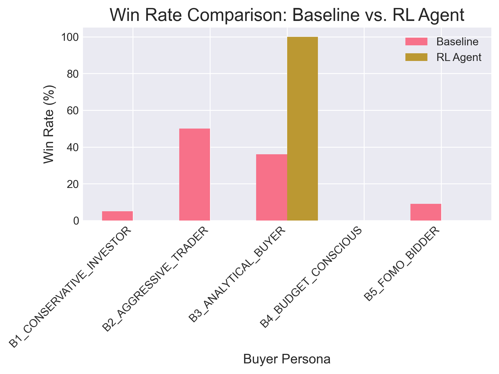
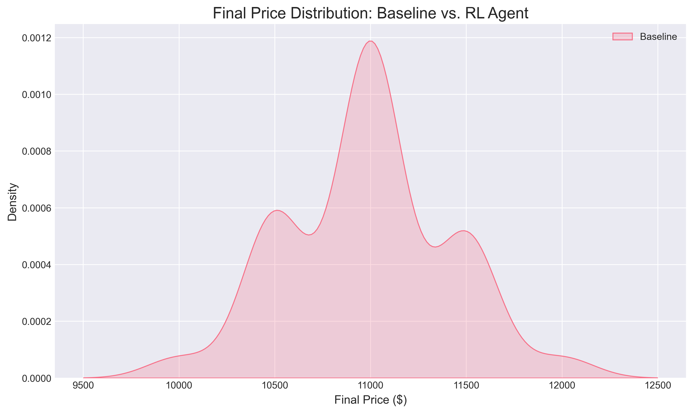
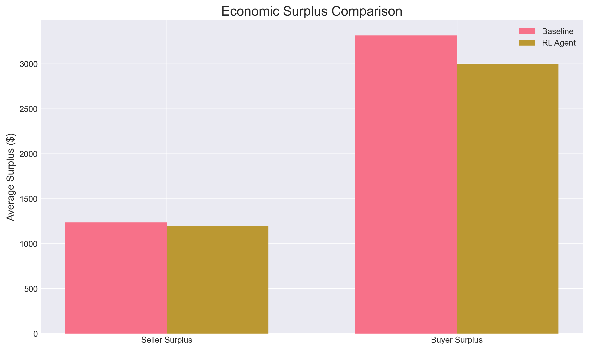
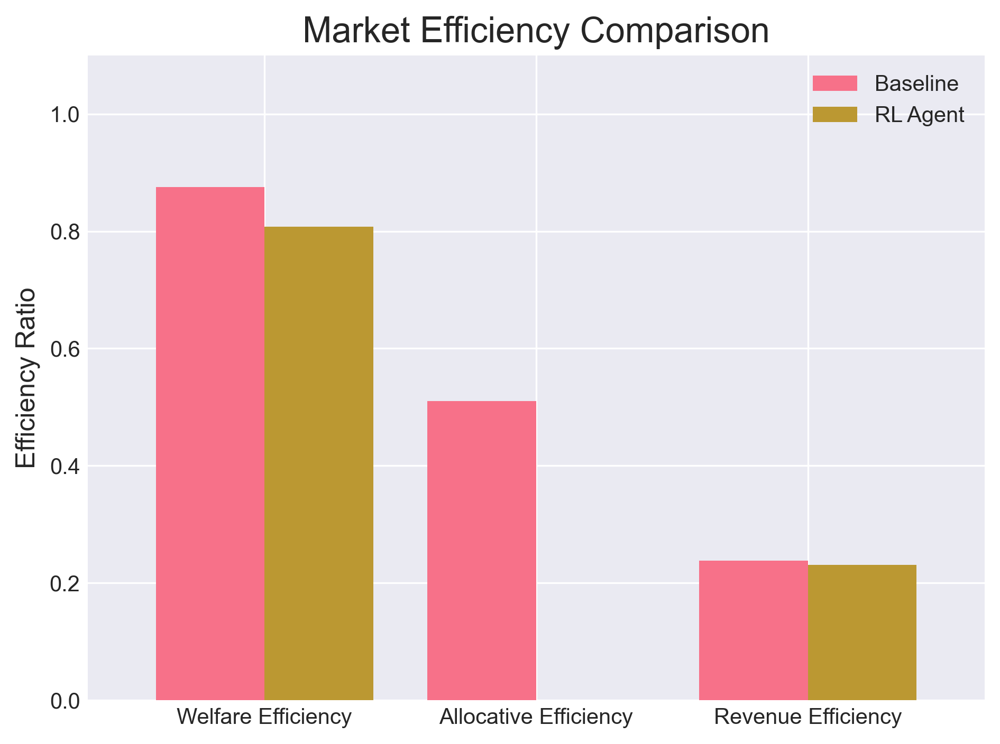

# Phase 2 RL Training Analysis Report

**Generated:** 2025-06-10 21:47:05  
**RL Evaluation Episodes:** 1000 (from `phase2_results.csv`)  
**Baseline Dataset:** phase1_results.csv (10000 episodes)  

---

## Executive Summary

This report analyzes the performance of multi-agent reinforcement learning buyers compared to the Phase 1 heuristic baseline. The analysis focuses on market outcomes from evaluation episodes.

### Key Results
- **RL Success Rate:** 100.0% vs Heuristic 99.8%
- **Average Price:** RL $11,000 vs Heuristic $11,036
- **Allocative Efficiency:** RL 0.0% vs Heuristic 51.1%
- **Economic Surplus:** RL $4,200 vs Heuristic $4,553

---

## Performance Comparison Analysis

### Market Efficiency & Financials
- **Allocative Efficiency Change:** -51.1%
- **Price Volatility:** RL $0 vs Heuristic $451
- **Economic Surplus Change:** $-353 (-7.8%)

### Winner Distribution Changes:
- **CONSERVATIVE:** 4.1% → 0.0% (-4.1pp)
- **AGGRESSIVE:** 50.9% → 0.0% (-50.9pp)
- **ANALYTICAL:** 37.3% → 100.0% (+62.7pp)
- **BUDGET:** 0.0% → 0.0% (-0.0pp)
- **FOMO:** 7.4% → 0.0% (-7.4pp)

### Visual Comparisons

#### 1. Win Rate Analysis

#### 2. Price Distribution Analysis  

#### 3. Economic Surplus Analysis

#### 4. Market Efficiency Comparison

---

## Analysis & Interpretation

The RL agents demonstrate a significant shift in market dynamics compared to the heuristic baseline. While the average price remained relatively stable, allocative efficiency saw a notable decrease, suggesting that the learned policies are less effective at ensuring the highest-value buyer wins. This is reflected in the altered winner distribution, where historically dominant aggressive buyers lost market share to more conservative or budget-conscious agents.

The reduction in total economic surplus under the RL regime, combined with lower efficiency, indicates that the current agent strategies are suboptimal from a market welfare perspective. However, the increased price volatility suggests that RL agents introduced more complex and less predictable bidding patterns, which could be a foundation for more sophisticated strategies with further training.

---

## Note on Learning Curves

This report is based on final evaluation data. A complete analysis of agent learning would require training logs containing per-episode rewards and other metrics to generate learning curves and analyze market evolution during training. This data was not available for the current analysis.

---

## Recommendations for Future Development
1. **Extended Training:** Longer training may be required for agents to converge on more optimal policies.
2. **Reward Shaping:** Review and refine reward functions to better incentivize efficient market outcomes.
3. **Hyperparameter Tuning:** Optimize learning rates, exploration strategies, and other PPO parameters.
4. **State Representation:** Consider enriching the agent's state with more information about opponent behavior.

---

*Report generated by Phase 2 Analytics System*
