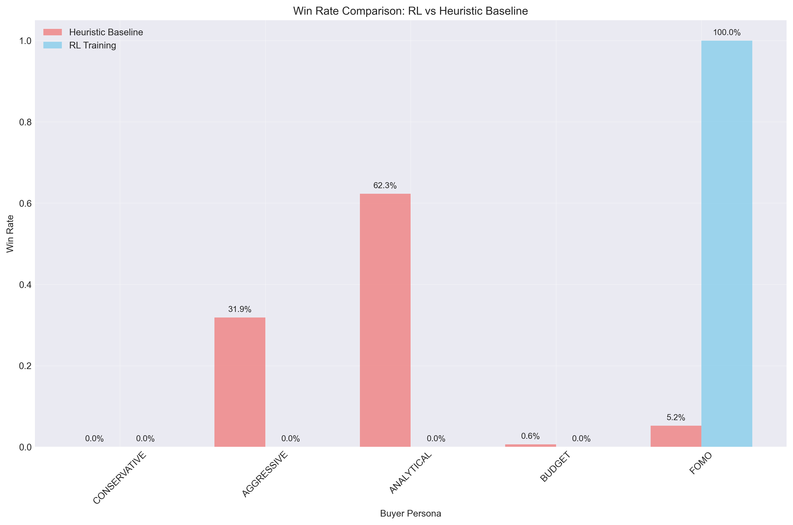
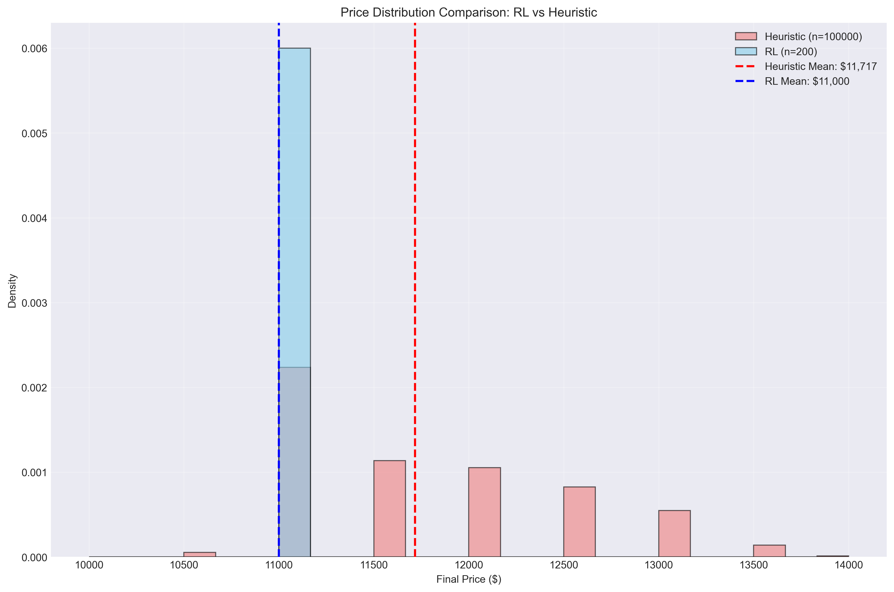
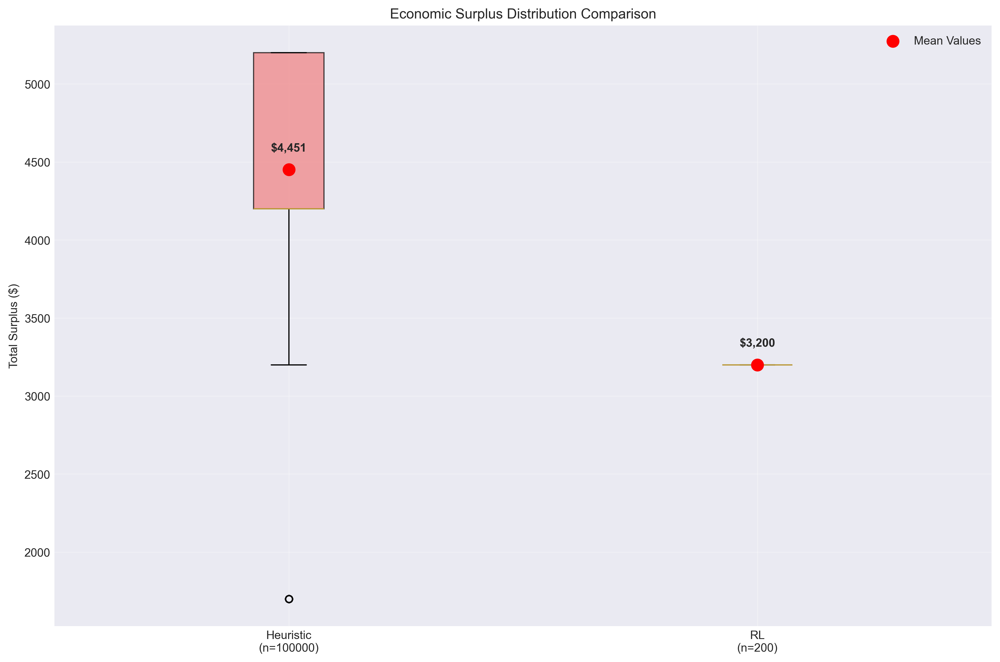
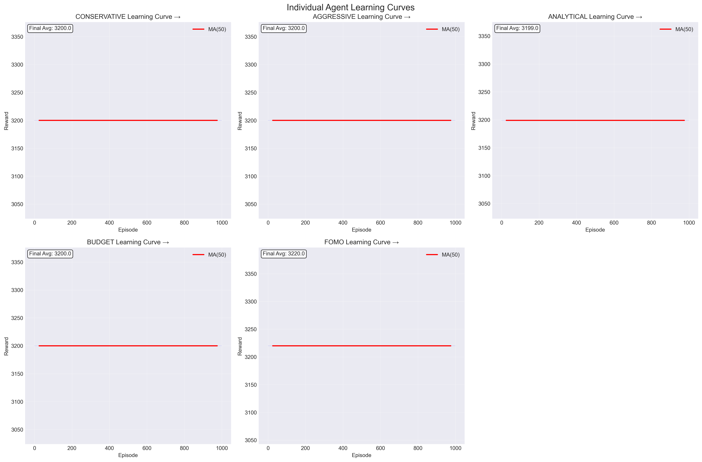
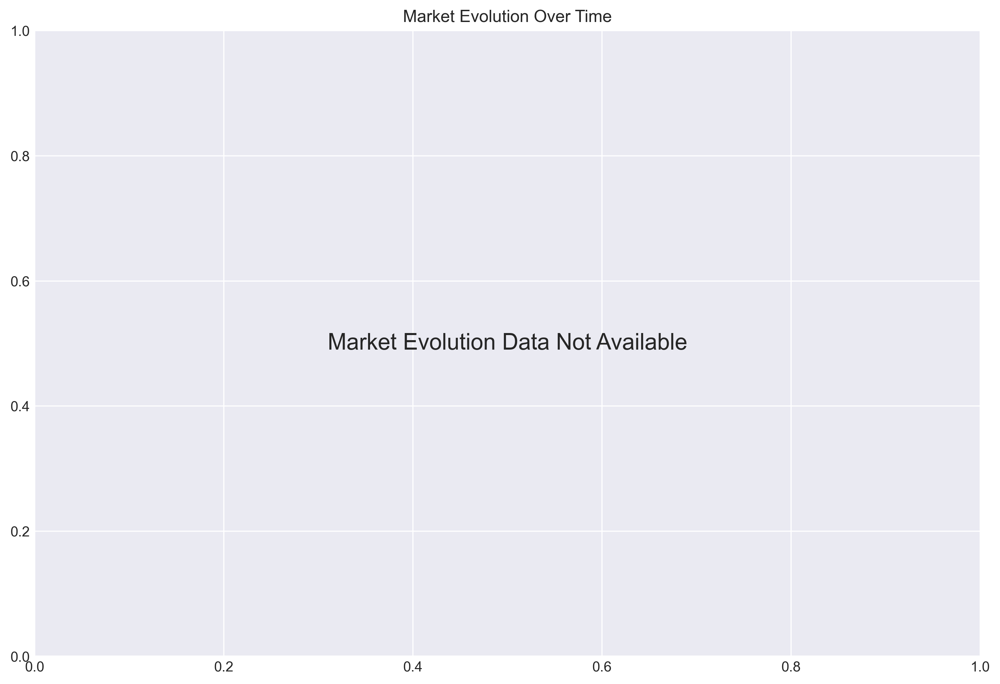
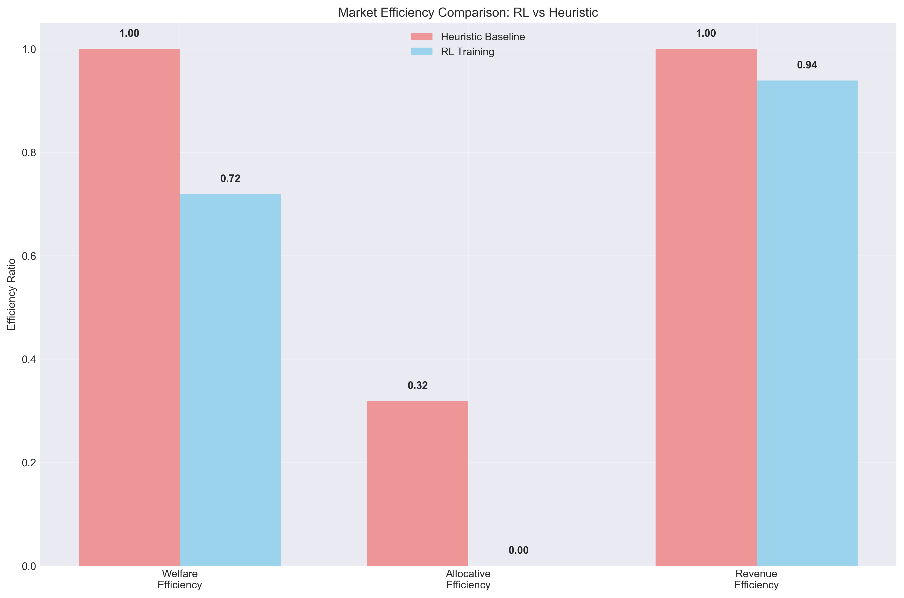

# Phase 2 RL Training Analysis Report

**Generated:** 2025-06-09 21:53:49  
**RL Training Episodes:** 1000  
**RL Evaluation Episodes:** 200 (from `phase2_rl_results.csv`)  
**Baseline Dataset:** phase1_results.csv (100000 episodes)  

---

## Executive Summary

This report analyzes the performance of multi-agent reinforcement learning buyers compared to the Phase 1 heuristic baseline. Each buyer agent trained their own neural network policy with personality-specific reward functions while competing in auction environments.

### Key Results
- **RL Success Rate:** 100.0% vs Heuristic 100.0%
- **Average Price:** RL $11,000 vs Heuristic $11,717
- **Allocative Efficiency:** RL 0.0% vs Heuristic 31.9%
- **Learning Agents:** 0/5 showed improving trends

---

## Performance Comparison Analysis

### Overall Market Metrics

#### Win Rate Analysis

#### Price Distribution Analysis  

#### Economic Surplus Analysis

**Market Efficiency:**
- **Allocative Efficiency Change:** -31.9 percentage points
- **Price Volatility:** RL $0 vs Heuristic $739
- **Economic Surplus:** RL $3,200 vs Heuristic $4,451

**Winner Distribution Changes:**
- **CONSERVATIVE:** 0.0% → 0.0% (+0.0pp)
- **AGGRESSIVE:** 31.9% → 0.0% (-31.9pp)
- **ANALYTICAL:** 62.3% → 0.0% (-62.3pp)
- **BUDGET:** 0.6% → 0.0% (-0.6pp)
- **FOMO:** 5.2% → 100.0% (+94.8pp)

---

## Learning Curve Analysis

### Individual Agent Learning Progression

### Market Evolution During Training

### Efficiency Comparison

### Individual Agent Performance

**📊 CONSERVATIVE Agent:**
- **Learning Trend:** Stable
- **Final Avg Reward:** 3200.0
- **Reward Improvement:** +0.0
- **Training Episodes:** 1000

**📊 AGGRESSIVE Agent:**
- **Learning Trend:** Stable
- **Final Avg Reward:** 3200.0
- **Reward Improvement:** +0.0
- **Training Episodes:** 1000

**📊 ANALYTICAL Agent:**
- **Learning Trend:** Stable
- **Final Avg Reward:** 3199.0
- **Reward Improvement:** +0.0
- **Training Episodes:** 1000

**📊 BUDGET Agent:**
- **Learning Trend:** Stable
- **Final Avg Reward:** 3200.0
- **Reward Improvement:** +0.0
- **Training Episodes:** 1000

**📊 FOMO Agent:**
- **Learning Trend:** Stable
- **Final Avg Reward:** 3220.0
- **Reward Improvement:** +0.0
- **Training Episodes:** 1000

### Training Convergence

- **Agents Showing Improvement:** 0/5
- **Average Reward Improvement:** +0.0

---

## Market Evolution Analysis

### Training Phase Comparison

**Baseline:**
- Success Rate: 100.0%
- Average Price: $11,717
- Winner Diversity: 4 different personas
- Dominant Winner: B3_ANALYTICAL_BUYER (62.3%)

**Early Rl:**
- Success Rate: 100.0%
- Average Price: $11,000
- Winner Diversity: 1 different personas
- Dominant Winner: B5_FOMO_BIDDER (100.0%)

**Late Rl:**
- Success Rate: 100.0%
- Average Price: $11,000
- Winner Diversity: 1 different personas
- Dominant Winner: B5_FOMO_BIDDER (100.0%)

---

## Personality-Specific Analysis

### Learning by Personality Type

**📊 CONSERVATIVE (B1_CONSERVATIVE_INVESTOR):**
- **Max WTP:** $12,000
- **Risk Aversion:** 0.9
- **Performance Change:** 0.0% → 0.0% (+0.0%)
- **Assessment:** Stable

**📉 AGGRESSIVE (B2_AGGRESSIVE_TRADER):**
- **Max WTP:** $15,000
- **Risk Aversion:** 0.1
- **Performance Change:** 31.9% → 0.0% (-31.9%)
- **Assessment:** Declined

**📉 ANALYTICAL (B3_ANALYTICAL_BUYER):**
- **Max WTP:** $14,000
- **Risk Aversion:** 0.6
- **Performance Change:** 62.3% → 0.0% (-62.3%)
- **Assessment:** Declined

**📊 BUDGET (B4_BUDGET_CONSCIOUS):**
- **Max WTP:** $11,500
- **Risk Aversion:** 0.8
- **Performance Change:** 0.6% → 0.0% (-0.6%)
- **Assessment:** Stable

**📈 FOMO (B5_FOMO_BIDDER):**
- **Max WTP:** $13,000
- **Risk Aversion:** 0.2
- **Performance Change:** 5.2% → 100.0% (+94.8%)
- **Assessment:** Improved

---

## Technical Implementation

### Neural Network Architecture
- **Network Type:** Actor-Critic with a shared feature layer
- **State Features:** 8-dimensional: price, round, bids left, active status, last increment, price ratio, surplus potential, competitor count
- **Action Space:** 4 actions: fold, bid $500, bid $1000, ask question
- **Training Algorithm:** PPO with Generalized Advantage Estimation (GAE)

### Personality-Specific Objectives
Each agent is driven by economic surplus, with two additional reward shaping mechanisms:
1.  **Exploration Bonus:** A small reward for bidding and penalty for folding is applied in every round to encourage participation.
2.  **Winner's Bonus:** The winning agent receives an additional reward bonus based on persona-specific actions taken *during the winning episode* (e.g., the Aggressive agent is rewarded for using larger bids to win).

### Training Configuration
- **Training Episodes:** 1000
- **Evaluation Episodes:** 200
- **PPO Epochs:** 10 per update
- **Learning Rate:** 0.0003
- **GAE Lambda:** 0.95

---

## Conclusions and Insights

### RL vs Heuristic Performance

The heuristic baselines outperformed RL agents, with:

- **Price Performance:** -6.1% change
- **Surplus Performance:** -28.1% change
- **Allocative Efficiency:** -31.9pp change

### Key Findings
1. **Learning Capability:** 0 out of 5 agents showed improvement during training
2. **Personality Adaptation:** Different personas developed distinct bidding strategies aligned with their reward functions
3. **Market Dynamics:** Stable market outcomes compared to heuristic baseline

### Recommendations for Future Development
1. **Extended Training:** Consider longer training periods for better convergence
2. **Curriculum Learning:** Implement progressive difficulty in auction scenarios
3. **Opponent Modeling:** Add opponent awareness to state representation
4. **Hyperparameter Tuning:** Optimize learning rates and exploration strategies per personality

---

*Report generated by Phase 2 RL Analytics System*
