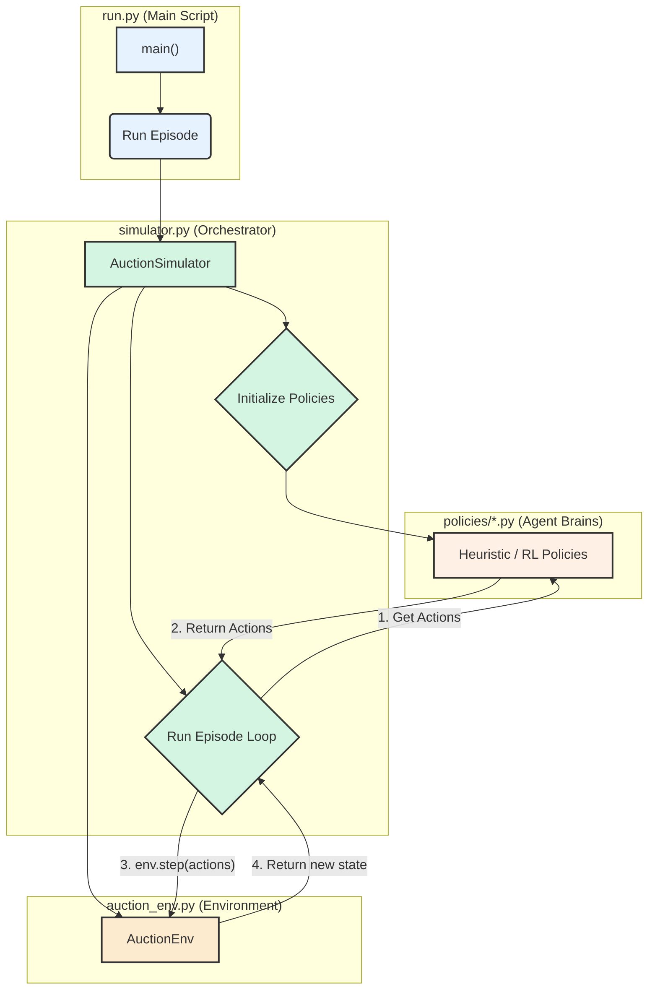

# 📈 Project Progress Report: Auction Simulator

**Date:** 2024-07-25

**Status:** Phase 1 (Monte Carlo) complete, Phase 2 (Reinforcement Learning) scaffolded.

---

## 📝 Executive Summary

This report outlines the current state of the Auction Simulator project, as orchestrated by the main execution script, `run.py`. The project is structured into three distinct phases, each with a specific goal, from initial testing to advanced reinforcement learning.

- **Phase 0 (Smoke Test):** Validates the core auction environment and heuristic policies by running a single, detailed episode.
- **Phase 1 (Monte Carlo Analysis):** Establishes a performance baseline by running thousands of simulations with rule-based (heuristic) agents and generating a detailed analytics report.
- **Phase 2 (Reinforcement Learning):** Focuses on training and evaluating intelligent agents to optimize auction strategies, comparing their performance against the Phase 1 baseline.

The system is designed with a modular architecture, separating the environment (`auction_env.py`), policies (`policies/`), and analytics (`phase1_analytics.py`, `phase2_analytics.py`). This structure facilitates independent development and clear, phase-gated progress. Recent efforts have focused on cleaning the codebase by removing redundant scripts and significantly refactoring the Phase 2 RL training logic to promote healthier agent competition and enable robust mid-training evaluation.

---

## 🏛️ System Architecture

The project follows a modular design that separates the core components, facilitating independent development and testing. The relationship between the main scripts is illustrated below:

-   **`run.py`**: The entry point that orchestrates the entire process based on user-provided arguments (e.g., `--phase`).
-   **`simulator.py`**: Contains the `AuctionSimulator` class, which acts as the "game master." It initializes the environment and policies, runs the episode loop, and collects data.
-   **`auction_env.py`**: Defines the `AuctionEnv` class, which is the "game board." It manages the rules of the auction, the state (price, bidders), and processes actions.
-   **`policies/`**: This directory holds the "brains" of the agents, defining *how* they decide on actions. This can be rule-based (`heuristic.py`) or learned (`rl_policy.py`).

This clear separation of concerns was recently improved by decoupling the `AuctionSimulator` from `run.py` into its own `simulator.py` module, enhancing modularity and maintainability.

---

## Phase 0: 💨 Smoke Test

### Purpose
The primary goal of Phase 0 is to provide a quick, verifiable test of the end-to-end simulation logic. It runs a single auction episode with verbose, round-by-round output to ensure that the environment, agent interactions, and basic auction mechanics are functioning correctly.

### Code Logic
- **Trigger:** Executed by running `python run.py --phase 0`.
- **Core Function:** `run_single_episode()` is called.
- **Process:**
    1.  An `AuctionSimulator` instance is created with `policy_type="heuristic"`.
    2.  The `run_episode()` method is invoked with `verbose=True`, printing detailed logs for each round.
    3.  The simulation uses the pre-defined `HeuristicPolicy` for all buyer agents and the seller.
    4.  An optional `--llm-seller` flag allows for testing the `LLMWrapper` for seller commentary, demonstrating integration with external language models.

### Relevant Scripts & Components
- **`run.py`:** The main entry point that parses the `--phase 0` argument and calls the appropriate function.
- **`auction_env.py`:** Defines the `AuctionEnv` class, which manages the state of the auction (price, bidders, rules).
- **`policies/heuristic.py`:** Contains the rule-based logic for buyer and seller agents, defining the baseline behavior.
- **`llm_wrapper.py` (Optional):** Used if the `--llm-seller` flag is active to generate dynamic seller text.

---

## Phase 1: 🎲 Monte Carlo Analysis

### Purpose
Phase 1 aims to generate statistically significant data on the performance of the heuristic policies. By running a large number of simulations (e.g., 10,000 episodes), we can establish a robust baseline for key metrics like final price, winner surplus, and market efficiency. This baseline is crucial for evaluating the performance of the RL agents in Phase 2.

### Code Logic
- **Trigger:** Executed by running `python run.py --phase 1`.
- **Core Function:** `run_batch_episodes()` is called.
- **Process:**
    1.  An `AuctionSimulator` is created with `policy_type="heuristic"`. LLM usage is disabled for performance.
    2.  The simulator runs a specified number of episodes (`--episodes` flag, defaults to 10,000) with `verbose=False`.
    3.  The results from each episode are collected and saved to a CSV file (e.g., `phase1_results.csv`).
    4.  After the simulations, if not disabled by `--no-analysis`, the `run_phase1_analysis()` function from `phase1_analytics.py` is called.
    5.  This analysis script loads the CSV results and generates a markdown report and visualizations summarizing the baseline performance.

### Relevant Scripts & Components
- **`run.py`:** Orchestrates the batch run and triggers the analysis.
- **`auction_env.py`:** The core environment, same as in Phase 0.
- **`policies/heuristic.py`:** Provides the consistent, rule-based strategies for the batch run.
- **`phase1_analytics.py`:** A dedicated script to read the output data, perform statistical analysis, and generate plots and a summary report for the heuristic policies.

---

## Phase 2: 🤖 Reinforcement Learning

### Purpose
Phase 2 is the advanced stage where we develop, train, and evaluate intelligent agents using Reinforcement Learning. The goal is to discover strategies that outperform the heuristic baseline from Phase 1, potentially leading to higher revenue for the seller and better outcomes for buyers.

### Code Logic
- **Trigger:** Executed by running `python run.py --phase 2`.
- **Core Function:** `train_and_evaluate_rl_agents()` is called, which orchestrates the two sub-phases below.

#### 1. Training Sub-Phase
- **Core Class:** `RLPolicyManager` (from `policies/rl_policy.py`) is the central component.
- **Process:**
    1.  **Initialization:** An `AuctionSimulator` is created with `policy_type="rl"` and `training_mode=True`. The `RLPolicyManager` initializes an independent `ActorCritic` network and an optimizer for each of the 5 buyer personas.
    2.  **Training Loop:** For each training episode:
        - **Experience Collection:** During the episode, the manager collects `state`, `action`, `log_probability`, and `value` for each agent's actions.
        - **End-of-Episode Update:** Once the episode finishes, `finalize_episode_and_update` is triggered.
            - **Reward Calculation:** The `_calculate_persona_reward` method computes a sophisticated, multi-part reward for each agent:
                - **Shared Reward:** A small portion of the total economic surplus is given to all agents to encourage successful auctions. A penalty is given if the auction fails.
                - **Winner's Reward:** The winning agent receives their full personal surplus (`max_wtp - final_price`) as the primary incentive to win.
                - **Style Bonus:** A small bonus is given to the winner for acting in character (e.g., an `AGGRESSIVE` agent winning with large bids).
            - **GAE & PPO Update:** The learning step proceeds using the calculated rewards to update the agent's policy.
        - **Periodic Evaluation:** At fixed intervals (e.g., every 100 episodes), a short, non-training evaluation run is performed. The results (e.g., average price, success rate) are saved to the training history, providing data for market evolution analysis.
    3.  **Model Saving:** After all training episodes, the final trained models for each buyer are saved to the `rl_models/` directory.

#### 2. Evaluation Sub-Phase
- **Process:**
    1.  A new `AuctionSimulator` is created with `policy_type="rl"` and `training_mode=False`.
    2.  The `RLPolicyManager` loads the trained models from the `rl_models/` directory.
    3.  It runs for a specified number of evaluation episodes (`--eval-episodes`) without performing any further training. Actions are taken greedily or with minimal exploration.
    4.  Results are saved to a new CSV file (e.g., `phase2_rl_results.csv`).

#### 3. Analysis Sub-Phase
- **Process:**
    - If not disabled, the `run_phase2_analysis()` function from `phase2_analytics.py` is called.
    - This script compares the performance of the RL agents against the Phase 1 baseline, generating a comparative report.

### Relevant Scripts & Components
- **`run.py`:** Orchestrates the entire training and evaluation pipeline.
- **`policies/rl_policy.py`:** Contains the `RLPolicyManager`, which is the brain of the RL operation. It manages the `ActorCritic` models, experience memory, reward shaping, GAE calculation, and the PPO update logic for all agents.
- **`phase2_analytics.py`:** A dedicated script for analyzing the performance of the trained RL agents, often by directly comparing `phase2_rl_results.csv` with `phase1_results.csv`. 