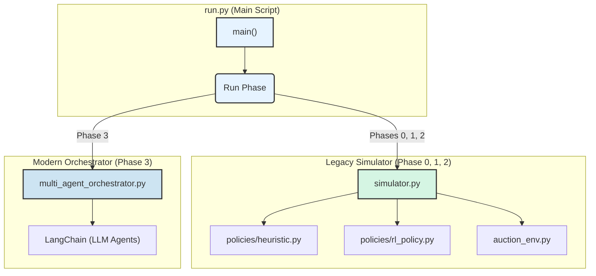
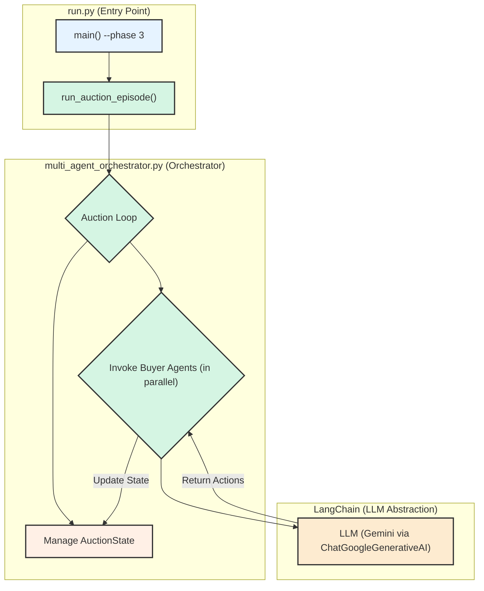

# 📈 Project Progress Report: Auction Simulator

**Date:** 2024-07-25

**Status:** Phase 1 (Monte Carlo) complete, Phase 2 (RL) scaffolded, Phase 3 (Multi-Agent LLM) implemented.

---

## 📝 Executive Summary

This report outlines the current state of the Auction Simulator project, as orchestrated by the main execution script, `run.py`. The project is structured into four distinct phases, each with a specific goal, from initial testing to advanced multi-agent simulation.

- **Phase 0 (Smoke Test):** Validates the legacy `AuctionSimulator` and heuristic policies by running a single, detailed episode. This provides a quick check that the environment for baseline and RL testing is functional.
- **Phase 1 (Monte Carlo Analysis):** Establishes a performance baseline by running thousands of simulations with rule-based (heuristic) agents and generating a detailed analytics report.
- **Phase 2 (Reinforcement Learning):** Focuses on training and evaluating intelligent agents to optimize auction strategies, comparing their performance against the Phase 1 baseline.
- **Phase 3 (LLM Multi-Agent Simulation):** The most advanced stage, which runs a full auction using a modern, robust multi-agent architecture where buyer agents are powered by LLMs and orchestrated in parallel.

The system has undergone a significant architectural refactoring, replacing a brittle custom orchestrator with a clean, "agent-as-tool" pattern for Phase 3, which is now the primary focus for intelligent agent simulation.

---

## 🏛️ System Architecture

The project follows a modular design that separates the core components, facilitating independent development and testing. The relationship between the main scripts is illustrated below:

-   **`run.py`**: The entry point that orchestrates the entire process based on the user-provided `--phase` argument.
-   **`simulator.py` / `auction_env.py`**: The legacy simulator and environment, used for generating the heuristic baseline (Phase 1) and training RL agents (Phase 2).
-   **`multi_agent_orchestrator.py`**: The modern, "agent-as-tool" orchestrator that runs the LLM-powered multi-agent simulation for Phase 3.

This clear separation of concerns allows for the stable legacy code to be used for baseline comparisons while new development is focused on the modern Phase 3 architecture.

---

## Phase 0: 💨 Smoke Test

### Purpose
The primary goal of Phase 0 is to provide a quick, verifiable test of the legacy end-to-end simulation logic. It runs a single auction episode with verbose, round-by-round output using the same `AuctionSimulator` that Phases 1 and 2 rely on. This ensures that the environment for creating a baseline and training RL agents is functioning correctly.

### Code Logic
- **Trigger:** Executed by running `python run.py --phase 0`.
- **Core Function:** `run_single_episode()` is called.
- **Process:**
    1.  An `AuctionSimulator` instance is created with `policy_type="heuristic"`.
    2.  The `run_episode()` method is invoked with `verbose=True`, printing detailed logs for each round.
    3.  The simulation uses the pre-defined `HeuristicPolicy` for all buyer agents and the seller.

### Relevant Scripts & Components
- **`run.py`:** The main entry point that parses the `--phase 0` argument.
- **`simulator.py`:** Contains the legacy `AuctionSimulator` class.
- **`auction_env.py`:** Defines the `AuctionEnv` class, which manages the auction state.
- **`policies/heuristic.py`:** Contains the rule-based logic for the test.

---

## Phase 1: 🎲 Monte Carlo Analysis

### Purpose
Phase 1 aims to generate statistically significant data on the performance of the heuristic policies. By running a large number of simulations (e.g., 10,000 episodes), we can establish a robust baseline for key metrics like final price, winner surplus, and market efficiency. This baseline is crucial for evaluating the performance of the RL agents in Phase 2.

### Code Logic
- **Trigger:** Executed by running `python run.py --phase 1`.
- **Core Function:** `run_batch_episodes()` is called.
- **Process:**
    1.  An `AuctionSimulator` is created with `policy_type="heuristic"`. LLM usage is disabled for performance.
    2.  The simulator runs a specified number of episodes (`--episodes` flag, defaults to 10,000) with `verbose=False`.
    3.  The results from each episode are collected and saved to a CSV file (e.g., `phase1_results.csv`).
    4.  After the simulations, if not disabled by `--no-analysis`, the `run_phase1_analysis()` function from `phase1_analytics.py` is called.
    5.  This analysis script loads the CSV results and generates a markdown report and visualizations summarizing the baseline performance.

### Relevant Scripts & Components
- **`run.py`:** Orchestrates the batch run and triggers the analysis.
- **`auction_env.py`:** The core environment, same as in Phase 0.
- **`policies/heuristic.py`:** Provides the consistent, rule-based strategies for the batch run.
- **`phase1_analytics.py`:** A dedicated script to read the output data, perform statistical analysis, and generate plots and a summary report for the heuristic policies.

---

## Phase 2: 🤖 Reinforcement Learning

### Purpose
Phase 2 is the advanced stage where we develop, train, and evaluate intelligent agents using Reinforcement Learning. The goal is to discover strategies that outperform the heuristic baseline from Phase 1, potentially leading to higher revenue for the seller and better outcomes for buyers.

### Code Logic
- **Trigger:** Executed by running `python run.py --phase 2`.
- **Core Function:** `train_and_evaluate_rl_agents()` is called, which orchestrates the two sub-phases below.

#### 1. Training Sub-Phase
- **Core Class:** `RLPolicyManager` (from `policies/rl_policy.py`) is the central component.
- **Process:**
    1.  **Initialization:** An `AuctionSimulator` is created with `policy_type="rl"` and `training_mode=True`. The `RLPolicyManager` initializes an independent `ActorCritic` network and an optimizer for each of the 5 buyer personas.
    2.  **Training Loop:** For each training episode:
        - **Experience Collection:** During the episode, the manager collects `state`, `action`, `log_probability`, and `value` for each agent's actions.
        - **End-of-Episode Update:** Once the episode finishes, `finalize_episode_and_update` is triggered.
            - **Reward Calculation:** The `_calculate_persona_reward` method computes a sophisticated, multi-part reward for each agent:
                - **Shared Reward:** A small portion of the total economic surplus is given to all agents to encourage successful auctions. A penalty is given if the auction fails.
                - **Winner's Reward:** The winning agent receives their full personal surplus (`max_wtp - final_price`) as the primary incentive to win.
                - **Style Bonus:** A small bonus is given to the winner for acting in character (e.g., an `AGGRESSIVE` agent winning with large bids).
            - **GAE & PPO Update:** The learning step proceeds using the calculated rewards to update the agent's policy.
        - **Periodic Evaluation:** At fixed intervals (e.g., every 100 episodes), a short, non-training evaluation run is performed. The results (e.g., average price, success rate) are saved to the training history, providing data for market evolution analysis.
    3.  **Model Saving:** After all training episodes, the final trained models for each buyer are saved to the `rl_models/` directory.

#### 2. Evaluation Sub-Phase
- **Process:**
    1.  A new `AuctionSimulator` is created with `policy_type="rl"` and `training_mode=False`.
    2.  The `RLPolicyManager` loads the trained models from the `rl_models/` directory.
    3.  It runs for a specified number of evaluation episodes (`--eval-episodes`) without performing any further training. Actions are taken greedily or with minimal exploration.
    4.  Results are saved to a new CSV file (e.g., `phase2_rl_results.csv`).

#### 3. Analysis Sub-Phase
- **Process:**
    - If not disabled, the `run_phase2_analysis()` function from `phase2_analytics.py` is called.
    - This script compares the performance of the RL agents against the Phase 1 baseline, generating a comparative report.

### Relevant Scripts & Components
- **`run.py`:** Orchestrates the entire training and evaluation pipeline.
- **`policies/rl_policy.py`:** Contains the `RLPolicyManager`, which is the brain of the RL operation. It manages the `ActorCritic` models, experience memory, reward shaping, GAE calculation, and the PPO update logic for all agents.
- **`phase2_analytics.py`:** A dedicated script for analyzing the performance of the trained RL agents, often by directly comparing `phase2_rl_results.csv` with `phase1_results.csv`.

---

## Phase 3: 🤖 LLM Multi-Agent Simulation

### Purpose
Phase 3 is the advanced stage where we run the auction using a modern **multi-agent orchestration architecture**. The goal is to simulate a realistic auction environment where multiple LLM-powered buyer agents act in parallel, orchestrated by a central controller. This uses the robust "agent-as-tool" pattern, ensuring the core components of state management, agent invocation, and parallel execution are functioning correctly.

### Code Logic
- **Trigger:** Executed by running `python run.py --phase 3`.
- **Core Function:** `run_auction_episode()` from `multi_agent_orchestrator.py` is called.
- **Process:**
    1.  An `AuctionState` object is initialized to manage the auction's state (price, bidders, history).
    2.  A specialized LangChain agent (a "runnable") is created for each buyer persona defined in `config.yaml`.
    3.  The orchestrator enters a loop that continues until the auction ends (e.g., no active bidders or max rounds reached).
    4.  Inside the loop, it invokes all active buyer agents **in parallel** using `asyncio.gather()`. Each agent receives the current `AuctionState` and its unique persona.
    5.  The orchestrator collects the structured `Action` objects from each agent's response.
    6.  It processes these actions to update the `AuctionState`—determining the new high bid, the leading bidder, and which buyers have folded.
    7.  The loop repeats until a winner is decided or the auction fails, at which point a final summary is printed.

### Architecture & Relevant Scripts
The new architecture is cleaner and more aligned with modern multi-agent design patterns.

- **`run.py`**: The main entry point. For Phase 3, it simply loads the configuration and calls the new orchestrator.
- **`multi_agent_orchestrator.py`**: This is the most important new script. It contains the `AuctionState` class for managing state, the logic for creating buyer agents, and the `run_auction_episode` function that orchestrates the entire auction loop.
- **`langchain_google_genai`**: This library is now used to create and invoke the LLM agents, providing a robust, managed connection to the Gemini API.
- **`config.yaml`**: Remains crucial for defining the auction rules and buyer personas that are fed to the agents. 